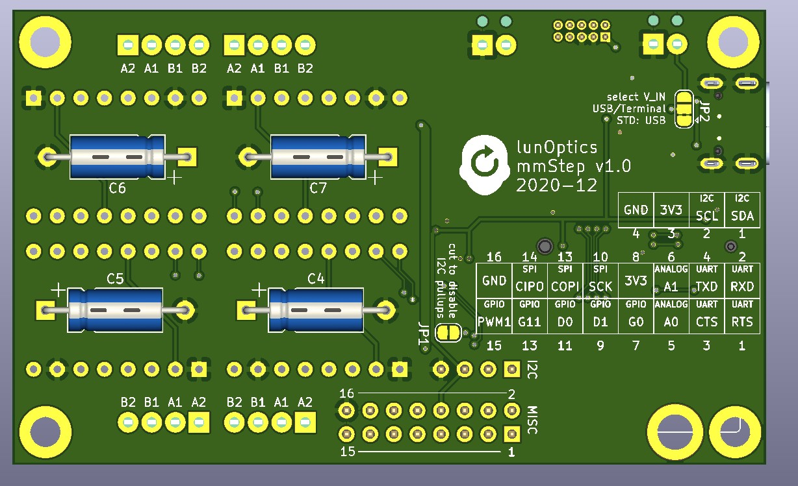

 

# mmStep
Stepper driver board compatible to the SparkFun MicroMod system for DRV8825, A4988 etc. driver boards.

## Features:
- Up to 4 stepper driver modules with standard layout (DRV8825, A4988 etc.)
- VIN can be chosen from USB (standard) or an external (4-6V) supply
- VMOT:  8-35V
- Micro-step selection as well as enable are handled by a I2C multiplexer (MCP23017)
- STEP/DIR signals are directly connected to the GPIOs
- A couple of signals are broken out on pads (100 mil raster) to connect to the outside world (see silk screen on the bottom layer)
- Two layer, 81x49mm
- USB-C connector

## Production data
Here a [link](https://octopart.com/bom-tool/kZcnFrtS) to an Octopart BOM
containing live updated prices and availability from major distributors. It also
provides links to datasheets, and technical information and alternative parts.

Gerbers and drill files can be found in the [production](/Production) folder

Schematic, pictures, pinouts and datasheets can be found in the [documentation](/Documentation) folder.

